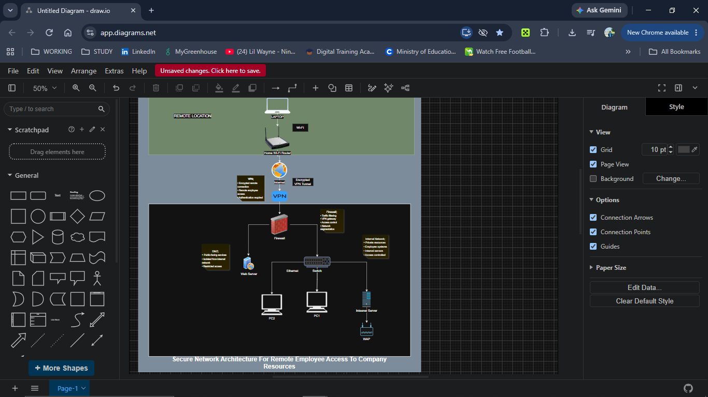

# Remote Employee Secure Network Design

## Project Overview

This project demonstrates the design of a secure network architecture for a remote employee accessing company resources.

The network design uses a VPN, firewall, DMZ, internal network segmentation, wired Ethernet connections, and wireless access to demonstrate how remote access can be separated from private company resources.

## Objectives

* Design a secure remote-access network architecture
* Demonstrate the use of a VPN for remote connectivity
* Separate public-facing services from internal resources using a DMZ
* Demonstrate network segmentation using a firewall
* Show wired and wireless network connections
* Document basic security controls and networking concepts

## Network Architecture

The architecture consists of three main areas:

### 1. Remote Employee Network

The remote employee connects to the internet through a home Wi-Fi router.

The employee uses a VPN connection to securely access approved company resources.

### 2. DMZ

The DMZ contains public-facing services such as the web server.

The DMZ is separated from the internal network to reduce the risk of direct access to private company resources.

### 3. Internal Network

The internal network contains private company resources, including:

* Network switch
* Employee PCs
* Internal server
* Wireless access point

The internal network is separated from the internet and DMZ by the firewall.

## Security Controls

### Firewall

The firewall acts as the main security boundary between the internet, DMZ, and internal network.

It can be used to:

* Filter network traffic
* Control access between network segments
* Enforce firewall rules
* Provide VPN access
* Restrict unauthorized connections

### VPN

The VPN provides an encrypted connection between the remote employee and the company's network.

This allows remote users to access authorized resources without exposing the internal network directly to the public internet.

### Network Segmentation

The network is divided into separate zones:

* Remote network
* DMZ
* Internal network

Segmentation helps limit unnecessary communication between systems and provides additional security boundaries.

## Technologies and Protocols

| Component             | Technology / Protocol              |
| --------------------- | ---------------------------------- |
| Remote laptop         | Wi-Fi                              |
| Home router           | Wi-Fi / WAN                        |
| Remote access         | VPN                                |
| Firewall              | Traffic filtering / Access control |
| Web server            | HTTPS                              |
| Internal devices      | Ethernet                           |
| Wireless access point | Wi-Fi / WPA2/WPA3                  |
| Network addressing    | IPv4                               |

## Example Network Segments

**DMZ:** `192.168.20.0/24`

**Internal Network:** `192.168.10.0/24`

These addresses are used as example private network segments for the design and are not connected to a production environment.

## Network Diagram

The full network architecture diagram is available in the `diagrams` folder.

## Tools Used

* diagrams.net (draw.io)
* GitHub

## Project Type

Cybersecurity / Networking Portfolio Project

## Key Concepts Demonstrated

* Network segmentation
* VPN
* Firewall
* DMZ
* Remote access
* Internal networks
* Wired networking
* Wireless networking
* Basic network security
* Network architecture documentation

## Learning Outcome

This project helped reinforce how remote users can securely connect to organizational resources and how firewalls and network segmentation can be used to separate public-facing services from internal company resources.

## Future Improvements

Possible improvements to this design include:

* Multi-factor authentication for VPN access
* Intrusion Detection/Prevention System (IDS/IPS)
* Network monitoring and logging
* Centralized identity and access management
* Endpoint security controls
* More detailed firewall rules
